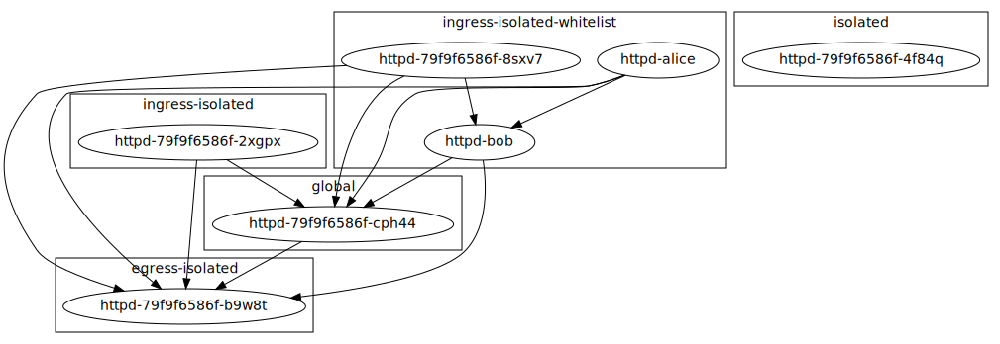
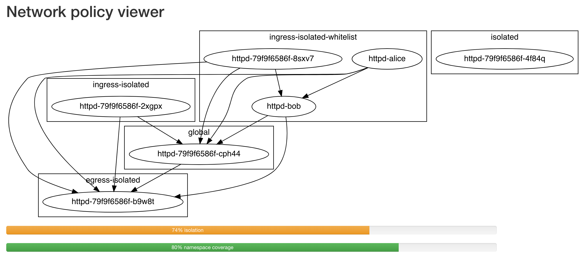

k8s-network-policy-viewer
=========================

<a href="https://hub.docker.com/r/gerald1248/k8s-network-policy-viewer/builds/">
  
  
</a>

The network policy viewer visualizes the pod network. It is far from complete, but basic isolation rules can be represented in JSON, YAML or dot (Graphviz).



In this example, the names of the namespaces match their respective network policies, the exception being the `global` namespace (which has none) and `ingress-isolated-whitelist` (which has two).

The policies `isolated`, `egress-isolated`, `ingress-isolated` each apply to the namespace as a whole.

`ingress-isolated-whitelist` whitelists `httpd-bob`, which is why `httpd-bob` can be reached from `httpd-alice` and the generic httpd pod in the namespace.

Deployment
----------
Install the helm chart defined in the folder [chart](./chart):
```
$ make -C chart install
```
Point your browser to the URL given in `values.yaml` (e.g. `http://minikube.info/`):



The available endpoints are:

| Endpoint        | Description      |
| --------------- | ---------------- |
| /               | Show graph       |
| /health         | Health endpoint  |
| /api/v1/metrics | Metrics endpoint |

Build
-----
The build steps are the following:
```
$ go mod download
$ go get
$ go vet
$ go test -v
$ go build -o k8s-network-policy-viewer .
```
`make build` will run these steps in a two-stage docker build process.

Alternatively, you can use the default image [k8s-network-policy-viewer](https://hub.docker.com/r/gerald1248/k8s-network-policy-viewer). This is also the image referenced in the helm chart.

Testdata
--------
To build the sample data, run:
```
$ make -C testdata init
$ make -C testdata create
```

Custom inputs
-------------
The application is intended for in-cluster use -- in which case it fetches the required API resources from the cluster -- but you can supply arbitrary input by piping the output of `kubectl get pod,namespace,networkpolicy --all-namespaces -o json` to it. The application accepts both JSON and YAML, but you may wish to work with JSON so you can filter the input with `jq`.
