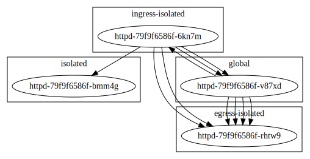

k8s-network-policy-viewer
=========================


The network policy viewer visualizes the pod network. It is far from complete, but basic isolation rules can be represented in JSON, YAML or dot (Graphviz).



In this example, the names of the namespaces match their respective network policies, the exception being the `global` namespace which has none.

The policies `isolated`, `egress-isolated`, `ingress-isolated` each apply to the namespace as a whole.

`ingress-isolated-whitelist` whitelists `httpd-bob`, which is why `httpd-bob` can be reached from both `global` pods (including of course `httpd-alice`) and the `ingress-isolated` namespace.

Deployment
----------
Install the helm chart defined in the folder [chart](./chart):
```
$ make -C chart install
```
Point your browser to the URL given in `values.yaml` (e.g. `http://minikube.info/`).

Build
-----
The build steps are the following:
```
$ go mod download
$ go get
$ go vet
$ go test -v
$ go build -o k8s-network-policy-viewer .
```
`make build` will run these steps in a two-stage docker build process.

Alternatively, you can use the default image [k8s-network-policy-viewer](https://hub.docker.com/r/gerald1248/k8s-network-policy-viewer). This is also the image referenced in the helm chart..

Testdata
--------
To build the sample data, run:
```
$ make -C testdata init
$ make -C testdata create
```

Custom inputs
-------------
The application is intended for in-cluster use (the Helm chart with appropriate cluster role is in preparation), but you can use the application today by piping or supplying the output of `kubectl get pod,clusterpolicy --all-namespaces -o json`. The application accepts JSON and YAML, but you may wish to work with JSON so you can filter the input with `jq`. This will no longer be necessary when the Helm chart is ready and the application runs within your cluster.
