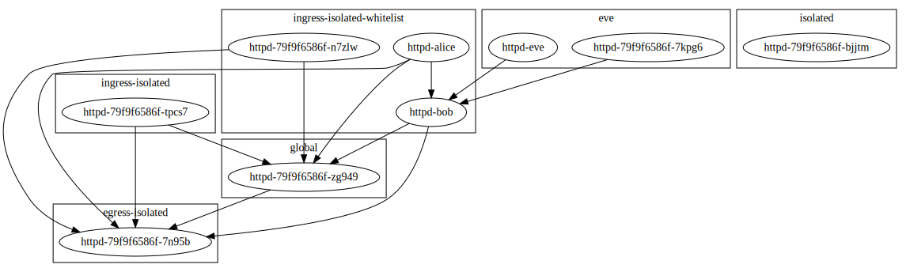

k8s-network-policy-viewer
=========================


The network policy viewer visualizes the pod network. Many pieces are either unfinished or missing, but basic isolation rules can be represented in JSON, YAML or dot (Graphviz):



Build
-----
The build steps are the following:
```
$ go mod download
$ go get
$ go vet
$ go test -v
$ go build -o k8s-network-policy-viewer .
```

Testdata
--------
To build the sample data, run:
```
$ make -C testdata init
$ make -C testdata create
```
